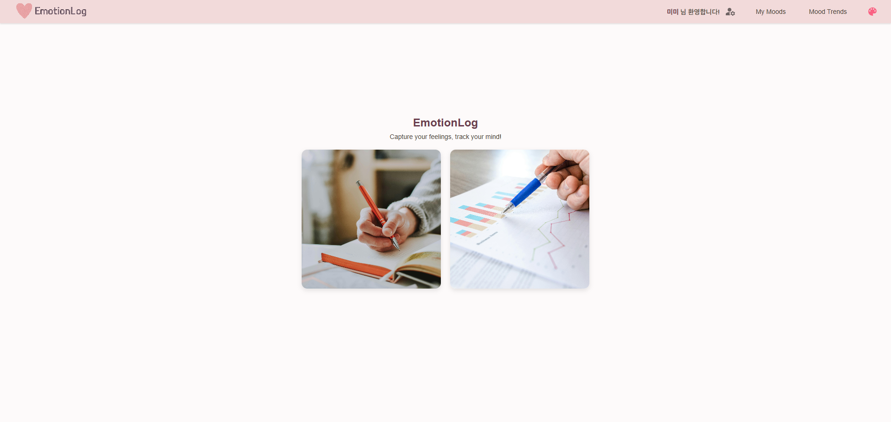

<p align="center">
  
</p>

## EmotionLog

_감정을 기록하고, 시각화하고, 스스로를 이해하기 위한 감정 일기 웹 플랫폼_

---

## 🧩 프로젝트 소개

| 항목          | 내용                                                          |
| ------------- | ------------------------------------------------------------- |
| 📌 프로젝트명 | EmotionLog                                                    |
| 🗓️ 개발 기간  | 2025.02 ~ 진행 중 (기능 추가 및 개선 계속 진행)               |
| 🛠️ 주요 기술  | React, TypeScript, Supabase, Redux Toolkit, Recharts, SCSS 등 |
| ✨ 주요 기능  | 감정 일기, 통계 대시보드, 감정 테마 연동, 다양한 필터 기능 등 |

- ✍️ 하루에 하나, 감정을 기록하고 메모 및 이미지 첨부 가능
- 📊 감정 통계 대시보드 (도넛 차트, 막대 그래프, 워드 클라우드, 요일별 분석 등)
- 📅 캘린더 필터, 통계 기간 필터, 감정 태그 필터, 페이지네이션
- 📌 로그인 기반 개인 감정 히스토리 저장
- 💬 감성적인 UI/UX (오늘의 감정에 따라 테마와 컬러 자동 변화)
- ✨ 감정 등록/수정/삭제, 필터 선택, 새로고침 시 로딩 스피너 처리로 UX 흐름 최적화

**EmotionLog**는 하루에 하나의 감정을 기록하고, 해당 데이터를 기반으로 감정 흐름과 통계를 제공하는 감정일기 플랫폼입니다.

단순한 기능 구현을 넘어 _‘감정’이라는 추상적인 데이터를 어떻게 직관적이고 감성적으로 표현할 수 있을까?_ 라는 질문에서 출발했습니다.

**기획 → 구조 설계 → 상태 관리 → UI 흐름 → 통계 분석 → 배포**까지  
전체 과정을 실제 서비스처럼 설계하고 구현하는 데 집중했습니다.

---

## 🖼️ 주요 화면 미리보기

| 메인 화면                       | 감정 기록                         | 감정 통계                         |
| ------------------------------- | --------------------------------- | --------------------------------- |
|  |  |  |

---

## 🔗 데모 / 배포 링크

👉 [EmotionLog 보러가기](https://my-diary2025-8afm.vercel.app/)

---

## 🚀 사용 기술 스택

### **Frontend**

React, TypeScript, SCSS, Redux Toolkit, classnames

- SPA 구조 설계 및 기능별 컴포넌트/페이지 분리 구현

### **UI Library**

Material UI v6, React Calendar

- MUI 기반 팝업/모달/입력 필드/체크박스 구성, 아이콘 사용, 캘린더 필터 구현

### **Chart**

Recharts(시각화), d3(데이터 흐름 제어), d3-cloud(워드 클라우드)

- 감정 비율 도넛차트, 요일별 분석 막대차트, 최대/최소 감정 비교 막대차트, 감정 메모 기반 워드클라우드 구현

### **상태 관리**

Redux Toolkit

- 감정 상태, 필터, 사용자 관리, 페이지네이션 등 전역 상태 통합 관리

### **Auth & DB**

Supabase (인증, 실시간 데이터베이스, Edge Function)

- 회원가입/로그인/탈퇴, 감정 기록 저장 및 삭제 처리 구현

### **Routing**

React Router DOM v7

- 인증 기반 페이지 보호 및 메인/기록/통계 화면 분기 처리

### **날짜 처리**

date-fns

- 감정 기록 날짜 비교 및 필터링

### **Lint & Quality**

ESLint, Prettier

- 코드 일관성과 가독성을 위한 린팅 및 자동 정렬 적용

### **Dev Tools**

Supabase CLI, Docker, json-server

- 로컬 DB 테스트, Edge Function 배포, 가상 API mock 테스트 구성

---

## ⚙️ 담당 역할

**EmotionLog**는 혼자 진행한 개인 사이드 프로젝트로, 아래의 모든 역할을 직접 수행했습니다.

| 역할 구분            | 상세 설명                                               |
| -------------------- | ------------------------------------------------------- |
| 🔹 기획 및 설계      | 감정 일기 플랫폼 기획, 기능 정의, 전체 UX 흐름 설계     |
| 🔹 프론트엔드 개발   | React + TypeScript 기반 SPA 구현, 기능별 모듈화 구성    |
| 🔹 상태 관리         | Redux Toolkit 활용하여 감정/회원/필터 상태 전역 관리    |
| 🔹 스타일링          | SCSS로 감성 테마 UI 구축, 반응형 레이아웃 구성          |
| 🔹 데이터베이스 설계 | Supabase DB 구조 설계, 감정 기록 저장 및 조회 쿼리 구성 |
| 🔹 인증 및 보안      | Supabase 인증/이메일 확인/비밀번호 재설정 구현          |
| 🔹 차트 분석 시각화  | Recharts, d3 활용한 감정 통계 차트 개발 및 사용자 분석  |
| 🔹 서버 사이드 작업  | Edge Function으로 회원 탈퇴 후 개인정보 삭제 예약 처리  |

---

## 📁 프로젝트 폴더 구조

```bash
📦src
┣ 📂auth                          // 회원가입, 로그인, 탈퇴 관련 모듈
┃ ┣ 📂leave
┃ ┣ 📂login
┃ ┗ 📂signup
┣ 📂global                        // 전역적으로 사용할 컴포넌트
┣ 📂pages                         // 실제 화면 페이지 구성
┃ ┣ 📂dashboard                   // 감정 통계 대시보드
┃ ┃ ┗ 📂chart/addon               // 차트 컴포넌트 & 서브 필터들
┃ ┣ 📂emotionBoard                // 감정 일기 게시판
┃ ┃ ┗ 📂addon                     // 캘린더 필터, 감정 태그 필터, 페이지네이션 등
┃ ┃ ┗ 📂modal                     // 등록/수정 모달
┃ ┗ 📂main                        // 메인 페이지
┃ ┃ ┗ 📂addon                     // 메인 카드 구성 및 헤더(navigation)
┃ ┃ ┃ ┗📂img                      // 로고, 메인 카드의 이미지들
┣ 📂routes                        // 전체 라우팅 설정
┣ 📂store                         // Redux 슬라이스 (auth, 감정, 필터, 페이지네이션 등)
┣ 📂styles                        // SCSS 전역 스타일 관리
┣ 📂types                         // 타입 선언 파일 (예: d3-cloud 타입 등)
┣ 📂utils                         // API 호출 등 유틸 함수
┃ ┣ supabaseApi.ts                // Supabase 관련 API 로직
┃ ┗ supabaseClient.ts             // Supabase 인스턴스 설정
📦supabase
┗ 📂functions/delete-old-users   // Edge Function: 탈퇴 회원 데이터 삭제 처리
┗ index.ts                        // 6개월 후 자동 삭제 로직 구현

📜 .env, package.json, tsconfig.json 등

EmotionLog는 기능별로 폴더를 명확히 분리해 유지보수성을 고려했습니다.
```

---

## 🚧 프로젝트 로드맵

### 🧑‍💻 회원 정보 관리

- 이메일 기반 회원 정보 관리

  - 이메일을 기반으로 회원가입, 로그인, 로그아웃, 회원 탈퇴 기능 구현
  - 비밀번호 재설정(찾기) 기능도 함께 제공하여, 사용자의 접근성을 향상시킴

- 회원 탈퇴 시 즉시 데이터 삭제 대신 deleted_at 필드로 소프트 삭제 처리
  - 6개월 후 Supabase Edge Function을 이용한 개인정보 자동 삭제 설계
  - 예약 삭제 로직은 비동기 Edge Function으로 구성

---

### 🏠 메인 페이지 구성

- 카드 형태의 직관적인 UI 제공

  - 감정 기록과 통계 대시보드 등 주요 기능들로 이동

- 로그인 상태에 따라 진입 제한

  - 로그인하지 않은 사용자는 경고창 안내 후 로그인 페이지로 이동

- 상단 네비게이션 바(Navbar)
  - 감정 기록, 통계 대시보드, 감정 테마, auth 관련 기능으로 빠르게 이동 가능

---

### 📓 감정 일기 기능

- 감정 기록 관리

  - 하루 한번 감정 일기 작성(수정)
  - 감정 선택과 사진 첨부 기능을 통해 사용자의 감정 상태를 보다 다채롭게 기록 가능
  - 자유로운 삭제, 수정, 조회, 등록

- 감정 분류

  - 기록된 감정은 날짜, 태그 기반으로 자동 분류
  - 캘린더를 통해 특정 날짜의 감정을 빠르게 확인
  - 감정 태그 + 날짜 필터를 조합하여 직관적으로 원하는 감정만 조회 가능
  - 다중 선택이 가능한 태그 필터로 복합적인 감정 분석 가능

- 페이지네이션

  - 페이지네이션 기능을 활용해 감정 목록이 많아져도 UX 깨짐 방지
  - Redux를 통해 페이지 정보가 유지되도록 처리하여, 사용자가 이전 페이지로 쉽게 복귀

---

### 📊 감정 통계 차트

- 차트 분석

  - 기록한 감정을 이용해 대시보드에서 감정 패턴을 시각적으로 확인
  - 전체 감정 비율과 감정별 기록수를 도넛 차트로 분석
  - 가장 많이 기록한 감정과 가장 적게 기록한 감정을 한눈에 확인
  - 요일별 감정 분포를 분석하여, 특정 요일에 느끼는 감정 패턴 확인
  - 기록된 감정 중 자주 등장하는 단어를 워드 클라우드를 통해 시각화

- 필터 작업

  - 기간 필터를 통해 일주일, 한달, 3개월, 6개월 단위로 감정 데이터 분석
  - 감정 데이터 기반으로 간단한 알고리즘을 통해, 일주일간 스트레스를 많이 받는 경우 안내 메시지 출력

---

### 🎨 감정 테마 연동 UI

- 감정에 따라 자동 테마 색상 변경

  - 감정 테마 상태를 sessionStorage에 저장하여 로그인/새로고침 시 복원
  - 기본 테마 유지 여부 설정 기능 추가 → 사용자의 테마 선호를 기억
  - 기본 테마 유지가 해제된 경우, 오늘의 감정에 따라 자동 테마 적용

- 새로고침 시 데이터 로딩 상태에 따른 UX 개선

  - 로딩 중에는 흰 배경과 스피너로 사용자에게 명확히 로딩 상황 안내
  - 데이터 로딩 후 300ms 지연 후 테마 적용 → 자연스럽고 감성적인 전환 처리

---

### 🐳 환경 구성 및 서버 기능

- Docker & WSL 설치 및 환경 구성 완료

  - 로컬 리눅스 개발 환경 구축을 위해 Docker + WSL2 설정 완료
  - **(현재 서비스는 Docker 기반으로 구동하진 않지만, 전체 설치 및 연동 경험 보유)**

- Supabase CLI 설치 및 프로젝트 초기화

  - CLI 명령어를 활용한 로컬 DB, 인증, Storage 테스트 경험
  - `supabase start`, `supabase link`, `.env` 구성, local dev + 배포 연동 완료

- Supabase Edge Function 직접 배포 및 테스트

  - 회원 탈퇴 시 `deleted_at` 기록
  - **6개월 후 개인정보 삭제 로직 구현** (Edge Function으로 예약 자동 삭제 처리)

---

### 🍒 이후 개발 예정 작업들

- 메인 페이지 개선

  - 카드 형식 → 슬라이드 애니메이션 형태로 변환(감정 중심 흐름이 더 자연스럽도록 개선)

- 회원가입 UX 개선

  - insert 정책 조정
  - 이메일 중복 확인 버튼 추가

- 감정 기록

  - 현재는 단일 날짜 선택만 가능
  - 향후 다중 날짜 선택 기능 도입 예정
    - 감정을 기록한 여러 날짜를 동시에 필터링(다른 라이브러리 도입 고려)

- UX 향상 처리

  - 반응형 웹 디자인 고려

- 감성 기능 확장

  - 힐링 요소 추가(ex: 포춘쿠키, 감정 기반 챗봇)

---

**EmotionLog**는 계속해서 기능과 디자인을 다듬고 있으며, 더 많은 감정을 다룰 수 있도록 성장 중입니다.

_당신의 오늘은 어떤 감정이었나요?_

Thanks for reading. 😇
